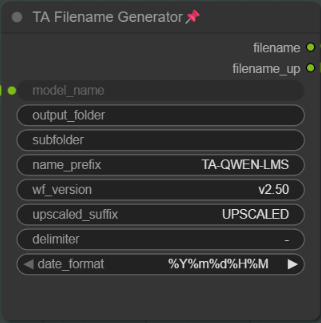
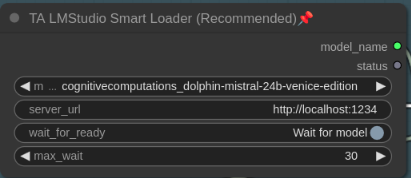

# TA-ComfyUI-Nodes-Pack  
A collection of various useful ComfyUI custom nodes  

## Installation

### Requirements
This custom node pack requires:
- **ComfyUI-GGUF** - Install it via ComfyUI Manager

### Installing ComfyUI-GGUF
1. Open ComfyUI Manager
2. Search for "ComfyUI-GGUF"
3. Click "Install"
4. Restart ComfyUI

___

## 1. Model Loaders   
1. ta_load_diffusion_model_with_name  
2. ta_load_checkpoint_model_with_name 
3. ta_load_gguf_model_with_name  

_These are model loaders with an additional output that displays the model name so that it can be used in the further workflow._  

.png)

___  
  
## 2. Extension for EBU-LMStudio
#### (https://github.com/burnsbert/ComfyUI-EBU-LMStudio)  
  
1. ***ta_lmstudio_load_on_run (text2prompt & image2prompt)*** \
Loads the LLM Model in the LM Studio server when you click RUN  
2. ***ta_lmstudio_model_selector (ext2prompt & image2prompt)*** \
Selection field for all models installed in LM Studio. Vision models are marked with (V).  
3. ***ta_ebu_lmstudio_vision_node (image2prompt)*** \
Settings for Image2Prompt Generation
  
_These are extensions for the EBU-LMStudio custom node. The ComfyUI-EBU-LMStudio node must be installed on your system._

.png) 

___ 

## 3. Filename Generator
The TAFilenameGenerator is a utility node for ComfyUI designed to automatically generate complex and organized file paths for saving images.

It outputs two separate strings:  
filename: The complete path and name for the main generated image.  
filename_up: A corresponding path and name for an upscaled version (it adds a suffix like "UPSCALED").

_Key Features_  
Dynamic Folders: It allows you to specify a main output_folder and a subfolder.

Date Parsing: The subfolder field can parse date/time codes (e.g., an input of %Y-%m-%d will be converted to a folder named 2025-11-13).  
Custom Naming: It builds the filename by combining several user-defined widgets:

name_prefix (e.g., "TA")  
wf_version (e.g., "v2.50")  
The model_name (from its input)  
A date_format (selected from a dropdown list)  
A delimiter (e.g., "-")

Ready to Use: The final strings (like TA-Outputs\2025-11-13\TA-v2.50-Modelname-202511132027.png) are passed to a SaveImage node, which will automatically create the directories and save the image.

---

## 4. Prompt Conroller
TA Prompt Controller (Switch) A custom node for ComfyUI designed to manage and route text inputs within a workflow. It serves as a central control unit to switch between manual text input and generated text (e.g., from LLMs or Vision models).

Key Features:  
    - Dual Input: Accepts both a manual text string and a generated prompt string.  
    - Mode Switching: Offers five modes to control the output:  
      1. Manual Only: Passes through the user's manual text, ignoring generated input.  
      2. Generated Only: Passes through the generated text (e.g., from LM Studio), ignoring manual input.  
      3. Combine: Manual + Generated: Prepends the manual text to the generated text.  
      4. Combine: Generated + Manual: Appends the manual text to the generated text.  
      5. Clear / Empty: Outputs an empty string (acts as a reset/mute).  
      
    - Custom Delimiter: Allows defining a separator (e.g., , ) for combining modes.

Use Case: Ideal for workflows that alternate between Text-to-Image (manual prompting), Image-to-Prompt (vision analysis), and Text-Expansion (LLM enhancement) without needing to rewire nodes.

---
## v1.0.8 (2025-11-25)  

1. added ***ta_prompt_controller***, a node designed to manage and route text inputs within a workflow.
---
## v1.0.6 (2025-11-13)

1. added ***ta_filename_generator***, a node for creating image output filenames and folders
---
## v1.0.5 (2025-11-01)

1. added ***ta_lmstudio_smart_loader***, a simple and fast loader for LM Studio Models
2. changed ***ta_lmstudio_load_on_run*** for more control if needed

 _new.png)
_new2.png)
