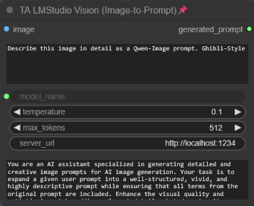

# TA-ComfyUI-Nodes-Pack  
A collection of various useful ComfyUI custom nodes  

## Installation

### Requirements
This custom node pack requires:
- **ComfyUI-GGUF** - Install it via ComfyUI Manager

### Installing ComfyUI-GGUF
1. Open ComfyUI Manager
2. Search for "ComfyUI-GGUF"
3. Click "Install"
4. Restart ComfyUI

___

## 1. Model Loaders   
1. ta_load_diffusion_model_with_name  
2. ta_load_checkpoint_model_with_name 
3. ta_load_gguf_model_with_name  

_These are model loaders with an additional output that displays the model name so that it can be used in the further workflow._  

.png)

___  
  
## 2. Extension for EBU-LMStudio
#### (https://github.com/burnsbert/ComfyUI-EBU-LMStudio)  
  
1. ***ta_lmstudio_load_on_run (text2prompt & image2prompt)*** \
Loads the LLM Model in the LM Studio server when you click RUN  
2. ***ta_lmstudio_model_selector (ext2prompt & image2prompt)*** \
Selection field for all models installed in LM Studio. Vision models are marked with (V).  
3. ***ta_ebu_lmstudio_vision_node (image2prompt)*** \
Settings for Image2Prompt Generation
  
_These are extensions for the EBU-LMStudio custom node. The ComfyUI-EBU-LMStudio node must be installed on your system._

.png) 