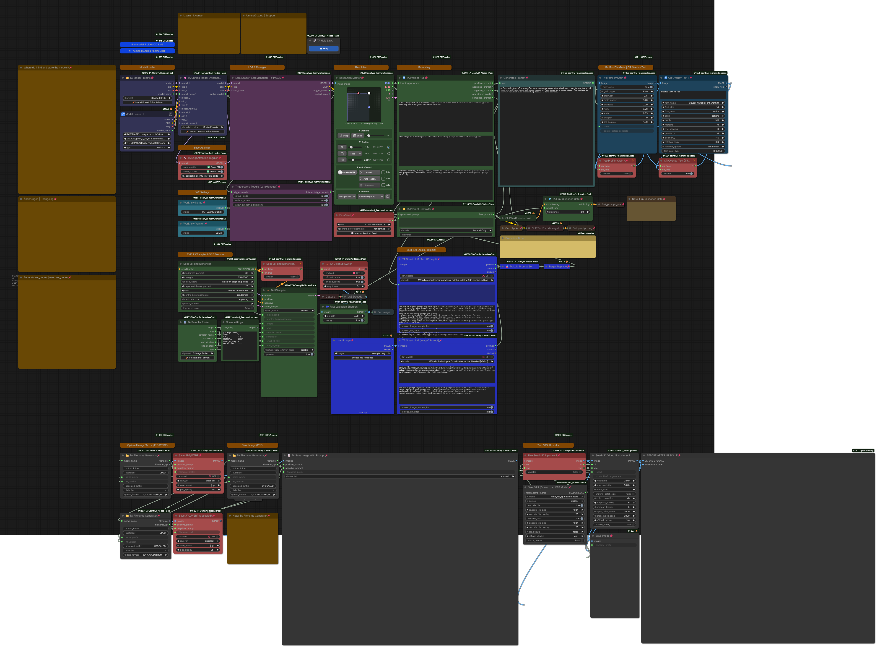

# TA-ComfyUI-Nodes-Pack

Custom nodes for [ComfyUI](https://github.com/comfyanonymous/ComfyUI) by **thomo.ART**.

> ⚠️ **Breaking Change – Version 2.x is not compatible with 1.x nodes.**
> Workflows built with version 1.x must be rebuilt. Node names, inputs, and outputs have changed significantly.



---

## Overview

A collection of nodes designed for use in thomo.ART workflows, focused on flexible multi-model image generation with LLM/VLM integration, structured prompt routing, and clean workflow management.

The full documentation is available via the built-in **Help button** in each node (opens in your browser at `http://localhost:8188/ta-nodes/wiki/index.html`).

---
## Credits
This project was inspired by or builds upon the following open-source works:

- **[ComfyUI-EBU-LMStudio](https://github.com/burnsbert/ComfyUI-EBU-LMStudio)** by [burnsbert (Eric W. Burns)](https://github.com/burnsbert)
  Inspiration for the LM Studio / LLM integration in ComfyUI, implemented in the **TASmartLLM** node with support for both LM Studio and Ollama.

- **[Comfyui-Memory_Cleanup](https://github.com/LAOGOU-666/Comfyui-Memory_Cleanup)** by [LAOGOU-666](https://github.com/LAOGOU-666)
  Inspiration for the VRAM and RAM cleanup logic in the **TACleanupSwitch** node.
---

## Changelog
**v2.0.3 changed ta_smart_llm**   
ta_smart_llm v3.1:  
- `unload_image_models_first` and `unload_llm_after` now default to `True`. Note that existing nodes in the workflow retain their saved values—the new default only applies to newly placed nodes.  

**v2.0.2 changed ta_smart_llm**  
ta_smart_llm v3.0 is the consolidated version with all fixes:
- Active models are now displayed at the top of the dropdown, offline models at the bottom — no validation error
- timeout=0.5 for all backend queries
- IS_CHANGED returns "disabled" if llm_enable=False — the node is cached
- _flush_lmstudio_context removed — saves the 0.5s pause before vision requests
- temperature + max_tokens as configurable parameters  

---
## Nodes

### 🧠 TA Unified Model Switcher
Switch between multiple models without changing the workflow. Uses a dropdown to select the active model – all others are skipped via lazy evaluation. Model list is configured via a browser-based editor.

### 🗂️ TA Model Preset
Load MODEL, CLIP, and VAE from a named preset. Supports Diffusion Models (`[D]`), GGUF (`[G]`), and Checkpoints (`[C]`). Presets are managed via a browser-based editor.

### 📦 TA Load Model (with Name)
Combined loader for all three model types. Auto-detects the type from the filename prefix and outputs a `TA_MODEL_NAME` string for use with the Filename Generator.

### 🤖 TA Smart LLM
Text-to-prompt and image-to-prompt via LM Studio or Ollama. Automatically detects vision-capable models. Supports VRAM management and model caching.

### 🔀 TA Prompt Hub
Central prompt collector. Passes through positive prompt, negative prompt, additional prompt, and LoRA trigger words. Combines non-empty parts into a single `combined_prompt` output.

### 🗂️ TA Prompt Controller
Routes between a manually typed prompt and a generated prompt (e.g. from TA Smart LLM). Five modes: Manual Only, Generated Only, two Combine orders, and Clear/Empty.

### 🎛️ TA Sampler Preset & ⚡ TA KSampler
Designed as a pair. TA Sampler Preset loads sampling parameters (steps, CFG, sampler, scheduler, start/end step) from a JSON file via browser editor. TA KSampler accepts sampler and scheduler as plain strings and provides live latent preview per step.

### 🧹 TA Cleanup Switch
Combined VRAM and RAM cleanup in one switchable node. Replaces a three-node cleanup chain. Passes any signal through unchanged. Can be fully disabled with zero overhead.

### 🌊 TA Flux Guidance Gate
Automatically applies Flux Guidance to conditioning when the active sampler preset is FLUX-based (detected via the preset name). Passes conditioning through unchanged for all other presets.

### 🔧 TA SageAttention Toggler
Patches a model with SageAttention and/or PyTorch FP16 matmul acceleration. Supports all five SageAttention kernel variants. Both patches are independent and toggleable.

### 📁 TA Filename Generator
Generates structured output file paths from folder, subfolder (supports strftime date codes), prefix, workflow version, model name, and timestamp. Returns both a base path and an upscaled variant path.

### 💾 TA Save Image Optional
Saves images as JPEG or WebP with configurable quality. Includes an enable toggle and optional companion `.txt` files with prompts and timestamp.

### 💾 TA Save Image With Prompt
Extends ComfyUI's built-in SaveImage with optional companion `.txt` files containing prompts and timestamp. Always saves as PNG.

### 🎬 TA SeedVR2 Gate
Enable/disable gate for the SeedVR2 upscaler pipeline using lazy evaluation. When disabled, all upstream nodes (including the ~14 GB model loaders) are skipped entirely.

### 💬 TA Discord Link
Displays a clickable Discord invite link directly inside the ComfyUI graph. URL and button label are configurable via a browser-based editor.

---

## Installation

### Via ComfyUI Manager
Search for `TA ComfyUI Nodes Pack` in the ComfyUI Manager and install.

### Manual
```bash
cd ComfyUI/custom_nodes
git clone https://github.com/thomoart/TA-ComfyUI-Nodes-Pack
```

Restart ComfyUI after installation.

---

## Documentation

Full node documentation (DE/EN) is built into the pack and accessible directly from ComfyUI via the **🔗 TA Help Link** node or at:

```
http://localhost:8188/ta-nodes/wiki/index.html
```

---

## License

- **Node Pack:** Apache 2.0
- **Workflows:** CC-BY-NC-SA 4.0

---

## Links

[](https://ko-fi.com/thomoart)
